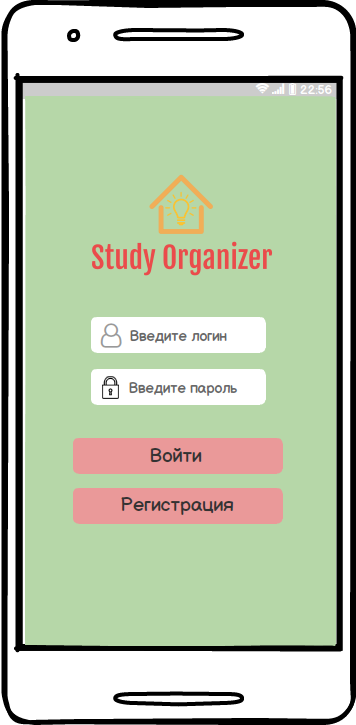
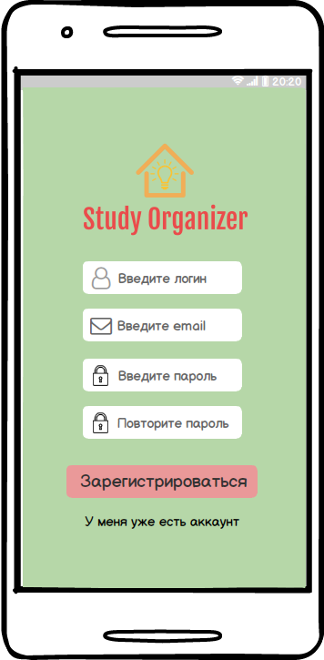

# Требования к приложению
---
# Содержание

1. [Введение](#introduction)   
1.1. [Назначение](#appointment)  
1.2. [Бизнес-требования](#business_requirement)  
&nbsp;&nbsp;&nbsp;&nbsp;1.2.1. [Исходные данные](#initial_data)    
&nbsp;&nbsp;&nbsp;&nbsp;1.2.2. [Бизнес-цели](#business_goals)   
&nbsp;&nbsp;&nbsp;&nbsp;1.2.3. [Границы проекта](#project_boundaries)   
&nbsp;&nbsp;&nbsp;&nbsp;1.2.5. [Предположения и зависимости](#assumptions_and_dependencies)   
1.3 [Аналоги](#analogues)

1. [Пользовательские требования](#users_requirements)   
2.1. [Программные интерфейсы](#software_interfaces)  
2.2. [Интерфейс пользователя](#user_interface)  
2.3. [Характеристики пользователей](#user_characteristics)  
&nbsp;&nbsp;&nbsp;&nbsp;2.3.1. [Классы пользователей](#user_classes)  
&nbsp;&nbsp;&nbsp;&nbsp;2.3.2. [Аудитория приложения](#application_audience)   

1. [Системные требования](#system_requirements)   
3.1. [Функциональные требования](#functional_requirements)    
3.2. [Нефункциональные требования](#non-functional_requirements)   
&nbsp;&nbsp;&nbsp;&nbsp;3.2.1. [Атрибуты качества](#quality_attributes)  
&nbsp;&nbsp;&nbsp;&nbsp;3.2.2. [Внешние интерфейсы](#external_interfaces)  
&nbsp;&nbsp;&nbsp;&nbsp;3.2.3. [Ограничения](#limitations)  
---

<a name="introduction"> 

# 1. Введение  

<a name="appointment"> 

## 1.1. Назначение 
В данном документе описываются бизнесс-требования, функциональные и нефункциональные требования к Android-приложению «Study Organizer». Этот документ предназначен для команды, которая будет реализовывать и проверять корректность работы данного приложения.

<a name="business_requirement">

## 1.2 Бизнес-требования   

<a name="initial_data"> 

### 1.2.1 Исходные данные  
Умение эффективно организовать своё время – очень актуальная задача. В нескончаемом потоке повседневных дел с лёгкостью можно запутаться, ведь с каждым днём их становится всё больше. События происходят все быстрее. Нужно вовремя реагировать на все изменения, укладываться во всё более жёсткие сроки. Незавершённые вчерашние дела становятся сегодняшними, а то, что не успели сделать сегодня, автоматически перекладывается на завтра. Такие или подробные ситуации зачастую происходят у людей, которые неэффективно организуют своё время.

<a name="business_opportunities"> 

### 1.2.2 Возможности бизнеса  
**«Study Organizer»** поможет поставить четкие цели, расставить приоритеты в учёбе, домашние задания не превратятся в мучения, всё необходимое будет под рукой.

<a name="project_boundaries">

### 1.2.3 Границы проекта
Приложение «Study Organizer» позволит авторизованным пользователям составлять расписание занятий на неделю, добавлять домашние задания, составлять простые и полезные заметки и отмечать важные события.

<a name="assumptions_and_dependencies"> 

### 1.2.4. Предположения и зависимости

+ Приложение не работает на смартфонах с версией Android 5.0 и ниже.
+ Пользователям доступен только однопользовательский режим.

<a name="analogues">

## 1.3 Аналоги 

Основной недостаток аналогов - малая функциональность.

* [Timetable](https://play.google.com/store/apps/details?id=com.gabrielittner.timetable&hl=ru)
    * наличие функции составления расписания.
* [TickTick](https://play.google.com/store/apps/details?id=com.ticktick.task&hl=ru)
    * наличие составления списка дел и задач.
---

<a name="users_requirements">

# 2. Пользовательские требования

<a name="software_interfaces"> 

## 2.1. Программные интерфейсы 
При разработке проекта «Study Organizer» используются API Xamarin.Forms и API Xamarin.Android.

<a name="user_interface"> 

## 2.2. Интерфейс пользователя
Графический интерфейс пользователя представлен в виде mock-up иллюстраций.

|Описание| Mockup  |
|---|---|
|Экран авторизации||
|Экран регистрации||
|Меню приложения||
|Экран с расписанием||
|Экран добавления нового предмета в расписание||
|Экран с домашними заданиями||
|Экран добавления домашнего задания #1||
|Экран добавления домашнего задания #2||
|Экран изменения или удаления домашнего задания||
|Экран заметок||
|Экран создания заметки #1| |
|Экран создания заметки #2||
|Экран событий||
|Экран добавления нового события||
|Экран добавления времени напоминаний для события #1||
|Экран добавления времени напоминаний для события #2||

 

<a name="user_characteristics"> 

## 2.3. Характеристики пользователей 

<a name="user_classes"/> 

### 2.3.1. Классы пользователей
|Класс пользователей|Описание|
|---|---|
|Зарегистрированные пользователи|Пользователи, которые вошли в приложение под своим именем (псевдонимом), желающие получить доступ к функционалу.|
<a name="application_audience"> 

### 2.3.2. Аудитория приложения 
+ Люди, которые хотят успешно организовывать свой день.
+ Школьники и студенты, которые смогут хранить все свои заметки и домашние задания в одном месте.

---

<a name="system_requirements">

# 3. Системные требования

<a name="functional_requirements">

## 3.1. Функциональные требования

1. Вход пользователя в приложение

|Функция|Требования|
|---|---|
|Регистрация|Приложение должно запросить у пользователя ввести никнейм, пароль и электронную почту для создания учётной записи. Пользователь должен либо ввести данные, либо отменить действие и авторизоваться.|
|Авторизация|Приложение должно предоставить пользователю список имён (псевдонимов) зарегестрированных пользователей. Пользователь должен либо выбрать из списка своё имя (псевдоним), либо отменить действие и написать свой никнейм. Приложение должно предоставить возможность ввода пароля.|

2. Настройка профиля активного пользователя  

|Функция|Требования|
|---|---|
|Добавление предмета в расписание|При нажатии на кнопку "Add" в разделе "Расписание" в отдельном окне пользователь выбирает предмет, класс, кабинет, учителя. После проверки введенных пользователем данных приложение добавляет нового пользователя в систему.|
|Удаление предмета из расписания|Зарегистрированный пользователь имеет возможножность удалить предмет из расписания, нажав на предмет и выбрав пункт "Удалить".|
|Добавление заметки|При нажатии на кнопку "Add" в разделе "Заметки" в отдельном окне пользователь пишет свою заметку, даёт ей название. Данные сохраняются в базе данных.|
|Удаление заметок|Зарегистрированный пользователь имеет возможножность удалить заметку, нажав на заметку и выбрав пункт "Удалить".|
|Добавление события|При нажатии на кнопку "Add" в разделе "События" в отдельном окне пользователь даёт название событию, выбирает время напоминания, цвет, иконку. После этого данные сохраняются в базе данных.|
|Удаление событий|Зарегистрированный пользователь имеет возможножность удалить события, нажав на событие и выбрав пункт "Удалить".|
|Добавление домашних заданий|При нажатии на кнопку "Add" в разделе "Д/З" в отдельном окне пользователь вводит домашнее задание и прикрепляет при необходимости фотографии.|
|Удаление домашних заданий|Зарегистрированный пользователь имеет возможножность удалить домашнее задание и прикреплённые файлы, нажав на событие и выбрав пункт "Удалить".|

3. Просмотр информации об отдельном предмете в расписании

|Функция|Требования|
|---|---|
|Просмотр краткой информации|Краткая информация отображается пользователю при переходе в окно "Расписание" в главном меню.|
|Просмотр подробной информации|Подробная информация отображается пользователю при нажатии на отдельный предмет в расписании. Дополнительно пользователь увидит преподавателя, который ведёт урок и время занятия.|

4. Выход зарегистрированного пользователя из учётной записи

|Функция|Требования|
|---|---|
|Выход из учётной записи|Приложение должно предоставить зарегистрированному пользователю возможность выйти из учётной записи с возвратом к окну входа в приложение.|

<a name="non-functional_requirements">

## 3.2. Нефункциональные требования

<a name="quality_attributes"> 

### 3.2.1. Атрибуты качества 
#### 3.2.1.1 Удобство и простота использвания
+ Приложение должно предоставлять единообразный вид между всеми окнами.
+ Приложение должно предоставлять поддержку нескольких языков.
+ Приложение должно иметь минималистичный дизайн, понятный каждому пользователю.
#### 3.2.1.2 Безопасность 
Приложение должно хранить данные пользователя в SQLite, и доступ к нему должно иметь только это приложение.

<a name="external_interfaces">

### 3.2.2. Внешние интерфейсы 
Окна приложения удобны для использования пользователями с плохим зрением: 
+ Крупный, адаптированный под разные экраны шрифт.
+ Функциональные элементы контрастны фону окна.
+ Дизайн без лишних элементов.

<a name="limitations">

### 3.2.3. Ограничения 
+ Профили пользователей и данные о расписании, заметках, событиях и домашних заданиях хранятся в локальной базе данных.
+ Приложение доступно для смартфонов с версией Android 6.0 и выше.
---