# Требования к приложению

1. [Введение](#introduction)   
1.1. [Назначение](#appointment)  
1.2. [Бизнес-требования](#business_requirement)  
&nbsp;&nbsp;&nbsp;&nbsp;1.2.1. [Исходные данные](#initial_data)  
&nbsp;&nbsp;&nbsp;&nbsp;1.2.2. [Возможности бизнеса](#business_opportunities)   
&nbsp;&nbsp;&nbsp;&nbsp;1.2.3. [Бизнес-цели](#business_goals)   
&nbsp;&nbsp;&nbsp;&nbsp;1.2.4. [Критерии успеха](#success_criteria)   
&nbsp;&nbsp;&nbsp;&nbsp;1.2.5. [Положение о концепции проекта](#project_concept_statement)   
&nbsp;&nbsp;&nbsp;&nbsp;1.2.6. [Бизнес-риски](#business_risks)  
&nbsp;&nbsp;&nbsp;&nbsp;1.2.7. [Предположения и зависимости](#assumptions_and_dependencies)   
1.3 [Аналоги](#analogues)

1. [Пользовательские требования](#users_requirements)   
2.1. [Программные интерфейсы](#software_interfaces)  
2.2. [Интерфейс пользователя](#user_interface)  
2.3. [Характеристики пользователей](#user_characteristics)  
&nbsp;&nbsp;&nbsp;&nbsp;2.3.1. [Классы пользователей](#user_classes)  
&nbsp;&nbsp;&nbsp;&nbsp;2.3.2. [Аудитория приложения](#application_audience)   

1. [Системные требования](#system_requirements)   
3.1. [Функциональные требования](#functional_requirements)    
3.2. [Нефункциональные требования](#non-functional_requirements)   
&nbsp;&nbsp;&nbsp;&nbsp;3.2.1. [Атрибуты качества](#quality_attributes)  
&nbsp;&nbsp;&nbsp;&nbsp;3.2.2. [Внешние интерфейсы](#external_interfaces)  
&nbsp;&nbsp;&nbsp;&nbsp;3.2.3. [Ограничения](#limitations)  
---

<a name="introduction"/> 

# 1. Введение 

Умение эффективно организовать своё время – очень актуальная задача. В нескончаемом потоке повседневных дел с лёгкостью можно запутаться, ведь с каждым днём их становится всё больше. События происходят все быстрее. Нужно вовремя реагировать на все изменения, укладываться во всё более жёсткие сроки. Незавершённые вчерашние дела становятся сегодняшними, а то, что не успели сделать сегодня, автоматически перекладывается на завтра. Такие или подробные ситуации зачастую происходят у людей, которые неэффективно организуют своё время.
**«Study Organizer»** поможет поставить четкие цели, раставить приоритеты в учёбе, домашние задания не превратятся в мучения, всё необходимое для будет под рукой. 

<a name="appointment"/> 

## 1.1. Назначение 
В данном документе описываются функциональные и нефункциональные требования к Android-приложению «Study organaizer». Этот документ предназначен для команды, которая будет реализовывать и проверять корректность работы данного приложения.

<a name="business_requirement"/>

## 1.2 Бизнес-требования   

<a name="initial_data"/> 

### 1.2.1 Исходные данные  

<a name="business_opportunities"/> 

### 1.2.2 Возможности бизнеса  

<a name="business_goals"/>

### 1.2.3 Бизнес-цели  

<a name="success_criteria"/>

### 1.2.4 Критерии успеха 

<a name="project_concept_statement"/>

### 1.2.5 Положение о концепции проекта

<a name="business_risks"/> 

### 1.2.6 Бизнес-риски 

<a name="analogues"/>

<a name="assumptions_and_dependencies"/> 

### 1.2.7. Предположения и зависимости

## 1.3 Аналоги 

---

<a name="users_requirements"/>

# 2. Пользовательские требования

<a name="software_interfaces"/> 

## 2.1. Программные интерфейсы 
Провект Study Organaizer использует **язык программирования C#** и фреймвор для кроссплатформенной разработки мобильных приложений **Xamarin**. Для хранения данных о расписании, преподавателях, заметках и задачах используется компактная встраиваемая СУБД **SQLite**.

<a name="user_interface"/> 

## 2.2. Интерфейс пользователя

+ Меню приложения  
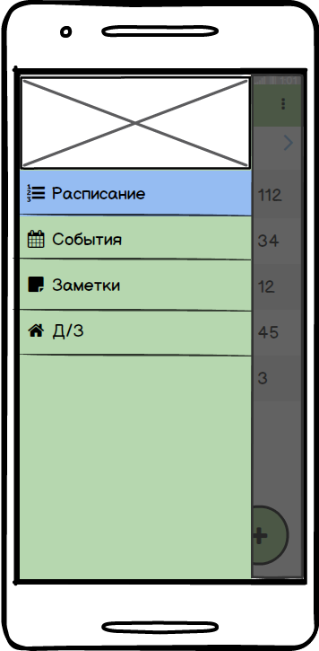

+ Экран с расписанием   
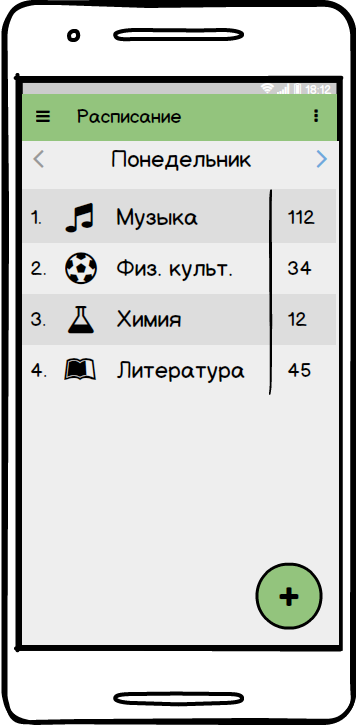

+ Экран добавления нового предмета в расписание  
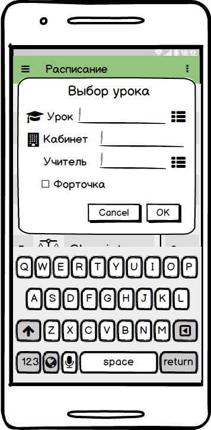

+ Экран с домашними заданиями  
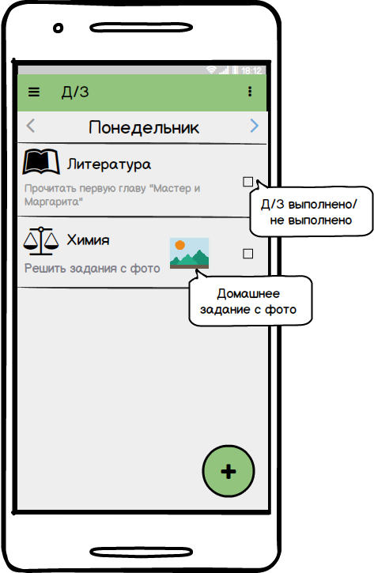

+ Экран добавления домашнего задания #1  
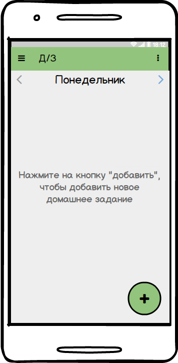

+ Экран добавления домашнего задания #2  
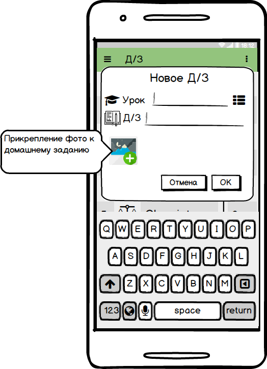

+ Экран изменения или удаления домашнего задания  
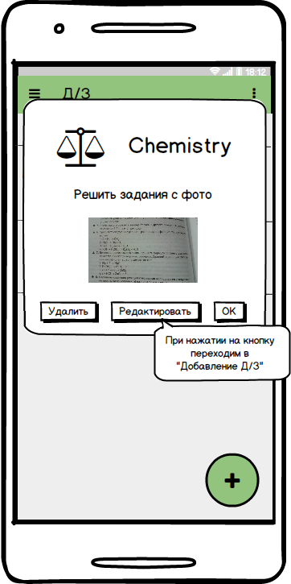

+ Экран заметок  
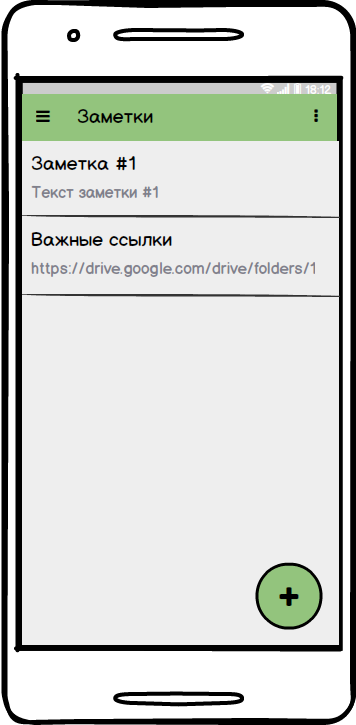

+ Экран создания заметки #1  
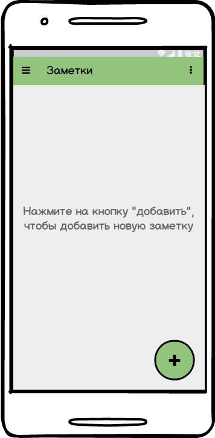

+ Экран создания заметки #2  
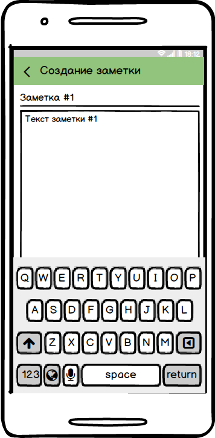

+ Экран событий  
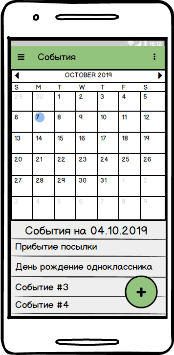

+ Экран добавления нового события  
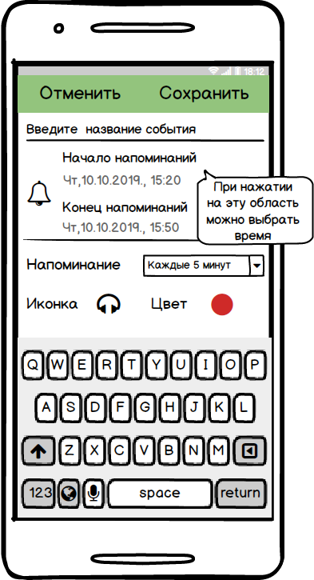

+ Экран добавления времени напоминаний для события #1  
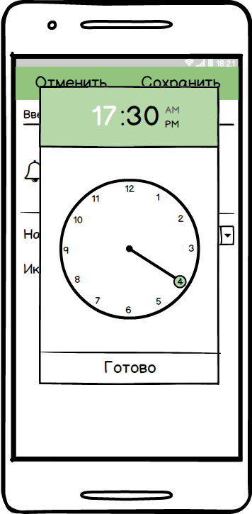

+ Экран добавления времени напоминаний для события #2  
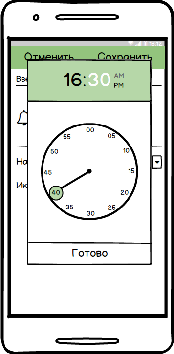

 

<a name="user_characteristics"/> 

## 2.3. Характеристики пользователей 

<a name="user_classes"/> 

### 2.3.1. Классы пользователей

<a name="application_audience"/> 

### 2.3.2. Аудитория приложения 

---

<a name="system_requirements"/>

# 3. Системные требования

<a name="functional_requirements"/>

## 3.1. Функциональные требования

<a name="non-functional_requirements"/>

## 3.2. Нефункциональные требования

<a name="quality_attributes"/> 

### 3.2.1. Атрибуты качества 

<a name="external_interfaces"/>

### 3.2.2. Внешние интерфейсы  

<a name="limitations"/>

### 3.2.3. Ограничения 