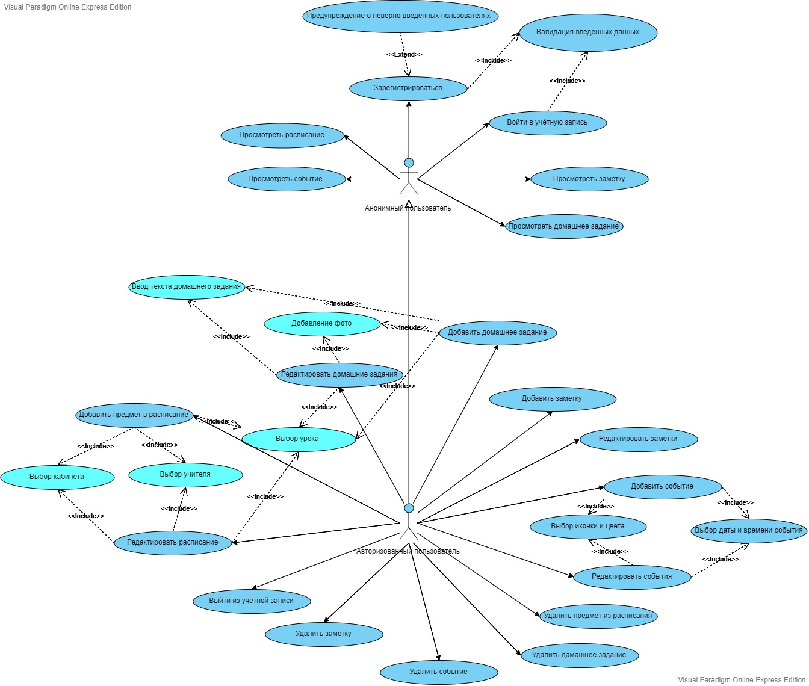

# Диаграмма вариантов использования
---

## Глоссарий
|Понятие|Определение|
|---|---|
|Анонимный пользователь|Человек, который использует приложение в анонимном режиме.
|Авторизованный пользователь|Человек прошедший процесс регистрации и находящийся в системе под своим логином.|
|Учётная запись|Хранимая в компьютерной системе совокупность данных о пользователе, необходимая для его опознавания (аутентификации) и предоставления доступа к его личным данным и настройкам.|
---
Для каждого варианта использования сценарии описаны в файле 
[Flow_of_events.md](https://github.com/BrushkouMatvey/Study-Organizer/blob/master/docs/System_design/Use_case/Flow_of_events.md)

